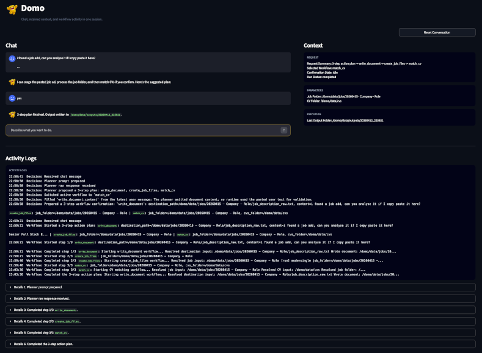

# Domo is your personal AI agent on your computer

This AI agent is designed to serve as a fully private, locally running personal assistant that helps users manage and understand their digital workspace without relying on external services. Its core aim is to provide a free, secure alternative to cloud-based tools by enabling intelligent operations on local documents (such as searching for information, summarizing files or entire folders, classifying and organizing content, and ranking documents by relevance) while also augmenting its capabilities with internet-based research. By combining local data access with AI-driven reasoning, it allows users to efficiently navigate and act on their information while keeping full control over their data.

<figure>
  
  <figcaption>Domo is your personal assistant on your computer</figcaption>
</figure>

## Run

Start Ollama before using the assistant.

Start the app with:

```bash
./run_app.sh
```

Run a workflow directly with:

```bash
.venv/bin/python -m tools.<name_of_tool>.main
```

Notes:

- Open the local URL shown by Streamlit, typically `http://localhost:8051`.
- The Streamlit assistant now uses a session-scoped chat UI with three panes:
  - chat for clarification and confirmation
  - a context panel showing retained parameter values, their source, and their status
  - an activity panel showing agent decisions and workflow progress, with raw workflow output available per run
- Domo always asks for confirmation in chat before executing a workflow.
- This repo must be run with the local [`.venv`](/Users/z/dev/domo/domo/.venv), not a global Streamlit install.
- `./run_app.sh` uses `.venv/bin/streamlit` explicitly, which avoids `ModuleNotFoundError` from Anaconda/global Python.
- If you prefer the raw command, use `.venv/bin/streamlit run app/streamlit_app.py --server.port 8051`.
- Use the `streamlit` CLI to run the app, not `python app/streamlit_app.py`.

## Structure

```text
domo/
├── README.md
├── config.yaml
├── pyproject.toml
├── requirements.txt
├── run_app.sh
├── app/
│   └── streamlit_app.py
├── assistant/
│   ├── audit.py
│   ├── domo_agent.py
│   ├── policy.py
│   ├── registry.py
│   ├── router.py
│   ├── runtime.py
│   └── schemas.py
├── integrations/
│   └── ollama_client.py
├── tools/
├── workflows/
└── data/
    ├── inputs/
    └── outputs/
        └── logs/
```

## License

This project is licensed under the MIT License.
